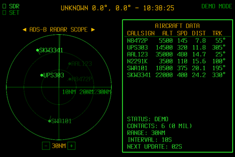

# Retro ADS-B Radar ✈

Aircraft radar display built with Python and Pygame. Visualises real-time aircraft positions from a local RTL-SDR dongle with a retro green-on-black radar aesthetic.

This is a fork of [nicespoon/retro-adsb-radar](https://github.com/nicespoon/retro-adsb-radar), heavily extended with new features.



## What this fork adds

**Radar behaviour**
- **Animated sweep** — rotating sweep line paints contacts as it passes, just like real radar; contacts fade between sweeps over a configurable persistence window

**Data sources**
- **dump1090 auto-start** — the app launches and manages dump1090 automatically; no separate setup required; closing the app stops it cleanly
- **Internet fallback** — if no RTL-SDR is detected, automatically falls back to live data from [adsb.lol](https://adsb.lol) (no API key required)
- **Hot-swap SDR ↔ NET** — tap the `◉ SDR` / `◉ NET` button at runtime to switch data sources without restarting

**Display**
- **Airport overlay** — airports within radar range drawn in amber with runway shapes to scale; labels on large and medium airports; small airports suppressed past 30 NM
- **In-app zoom** — tap `[-]` / `[+]` below the radar or use the scroll wheel to change range (10–300 NM presets); airport data reloads automatically on zoom
- **Anti-aliased rendering** — smooth circles, lines, and text via `pygame.gfxdraw`
- **Auto-scaling** — detects screen resolution at startup and scales all UI elements, fonts, and trail lengths accordingly; works on the Pi 7" touchscreen and larger monitors

**Controls & settings**
- **Live settings menu** — tap `⚙ SET` to open an in-app overlay for editing any `config.ini` value; changes apply instantly without restarting
- **Close button** — on-screen `X` button for touchscreen users; `Q` / `ESC` also quits
- **Desktop launcher** — `.desktop` file and `launch.sh` script for launching from the Raspberry Pi start menu

## Hardware Requirements

- Raspberry Pi (Pi 4 or Pi 5 recommended)
- [RTL-SDR Blog V4](https://www.rtl-sdr.com/rtl-sdr-blog-v-4-dongle-initial-release/) or similar RTL-SDR dongle
- 1090 MHz antenna
- Display (works well on the official Raspberry Pi 7" touchscreen)

## Quick Start

### 1. Install the RTL-SDR Blog driver

The standard `librtlsdr` package does not fully support the V4 dongle. Install the RTL-SDR Blog driver instead:

```bash
sudo apt remove librtlsdr-dev rtl-sdr
git clone https://github.com/rtlsdrblog/rtl-sdr-blog.git
cd rtl-sdr-blog && mkdir build && cd build
cmake .. -DINSTALL_UDEV_RULES=ON
make -j4 && sudo make install && sudo ldconfig
echo 'blacklist dvb_usb_rtl28xxu' | sudo tee /etc/modprobe.d/blacklist-rtl.conf
```

### 2. Build dump1090

```bash
sudo apt install -y libncurses-dev
git clone https://github.com/flightaware/dump1090.git
cd dump1090 && make -j4
```

### 3. Clone and set up the radar

```bash
git clone https://github.com/MrTechnical77/retro-adsb-radar-rtlsdr.git
cd retro-adsb-radar-rtlsdr
python3 -m venv venv
source venv/bin/activate
pip install -r requirements.txt
cp config.ini.example config.ini
nano config.ini
```

Set your latitude, longitude, and area name in `config.ini`, then run:

```bash
python3 main.py
```

The app will automatically start dump1090, wait for it to initialise, then launch the radar UI. Closing the app also stops dump1090. If no dongle is connected it falls back to internet data automatically.

### 4. Optional: launch from the desktop

```bash
chmod +x launch.sh
cp retro-adsb-radar.desktop ~/.local/share/applications/
```

The app will appear in the Raspberry Pi start menu under Accessories.

## Configuration

All settings live in `config.ini` and can also be changed live from the in-app settings menu.

```ini
[General]
FETCH_INTERVAL = 10           # How often to poll for new data (seconds)
MIL_PREFIX_LIST = 7CF         # Comma-separated ICAO hex prefixes to flag as military
TAR1090_URL = http://localhost:8080/aircraft.json
BLINK_MILITARY = true         # Blink military contacts red on sweep
SHOW_AIRCRAFT_TRAILS = true   # Show speed/direction trail lines on contacts
SWEEP_PERIOD = 6.0            # Seconds per full radar sweep rotation
CONTACT_PERSISTENCE = 5.0     # How long (seconds) a contact stays visible after being swept
                              # Set to 0 for flash-only with no fade

[Audio]
ATC_STREAM_URL =              # URL of a live ATC audio stream (leave blank to disable)
AUTO_START = false            # Start ATC stream automatically on launch

[Location]
LAT = 0.0                     # Your latitude
LON = 0.0                     # Your longitude
AREA_NAME = UNKNOWN           # Name displayed in the header
RADIUS_NM = 60                # Initial radar range in nautical miles

[Display]
FPS = 6                       # Frames per second (lower = less CPU on Pi)
MAX_TABLE_ROWS = 10           # Max aircraft rows in the data table
FONT_PATH = fonts/TerminusTTF-4.49.3.ttf
BACKGROUND_PATH =             # Optional background image path
TRAIL_MIN_LENGTH = 8          # Minimum aircraft trail length (pixels at base resolution)
TRAIL_MAX_LENGTH = 25         # Maximum trail length
TRAIL_MAX_SPEED = 500         # Speed (knots) at which trail reaches maximum length
```

## How the radar sweep works

Aircraft contacts only appear when the rotating sweep line passes over them. Between sweeps, contacts fade from full brightness over the duration set by `CONTACT_PERSISTENCE`. The data table on the right also only updates when the sweep hits each aircraft.

Zoom can be changed live with the `[-]` and `[+]` buttons below the radar scope, or with the scroll wheel. Available ranges: 10, 20, 30, 50, 75, 100, 150, 200, 300 NM. Past 30 NM, small airports are hidden. Past 50 NM, callsigns are only shown for military contacts.

## Airport overlay

On first run the app downloads airport and runway data from [OurAirports](https://ourairports.com/) and caches it to `~/.cache/retro-adsb-radar/`. Airports within your radar range are drawn in amber — large and medium airports show runway shapes and ICAO idents, small airports show as small squares.

## Demo mode

`demo.py` runs a self-contained demo with simulated aircraft — no RTL-SDR required. It warms up for a few seconds, then records one full sweep cycle to `images/demo.gif` and exits.

```bash
python3 demo.py
```

Pass `--no-record` to run without saving a GIF.

## Troubleshooting

**RTL-SDR device busy on startup:** another process has the dongle. Run `pkill -f dump1090` and try again.

**No contacts appearing:** wait up to one full sweep period (default 6 seconds) for the sweep to paint all contacts for the first time.

**SDL dependency errors:**
```bash
sudo apt install libsdl2-2.0-0 libsdl2-ttf-2.0-0 libsdl2-image-2.0-0
```

## License

- Project code: MIT License (see `LICENSE`)
- Fonts: SIL Open Font License Version 1.1 (see `fonts/` directory)
